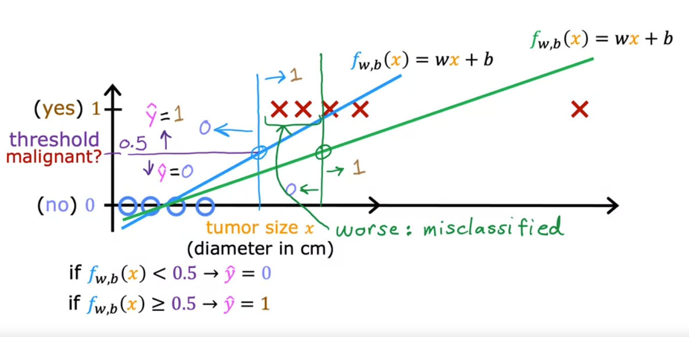
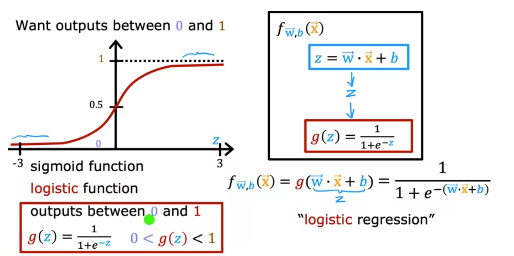
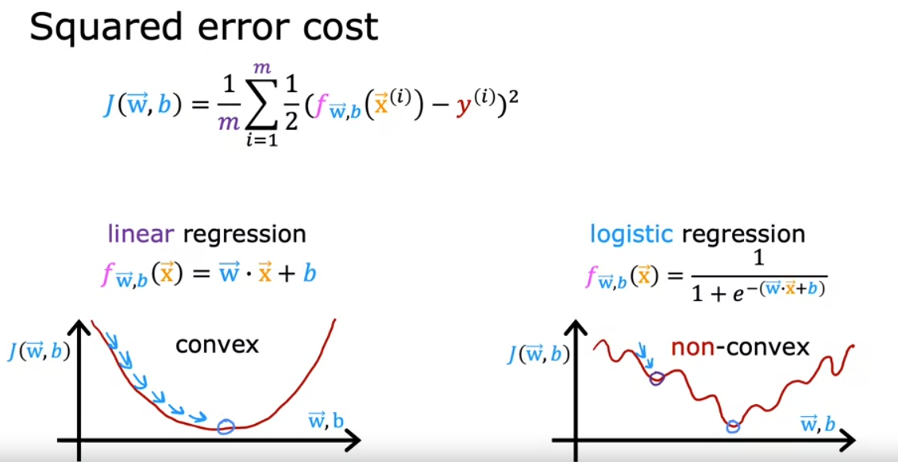

# Logistic Regression
<p>
Logistic regression is a way for a computer to learn how to make good guesses. Let's say you want to teach a computer to guess if a person is a boy or a girl based on their height and weight. You would show the computer lots of examples of boys and girls and their heights and weights, and then the computer would learn how to make good guesses based on that information.
</p>
<p>
Imagine you are playing a guessing game with a friend, and your friend is showing you pictures of different people and you have to guess if it's a boy or a girl. The more pictures your friend shows you, the better you will get at guessing correctly. Logistic regression is like that game, but the computer is trying to guess instead of you.
</p>
<p>
It's like learning to play a game and the computer gets to play it better and better the more it plays.
</p>
<p>
In the below example, we'll use Python to create the algorithm from scratch.
</p>


## Why not use Linear Regression for classification?

Linear Regression creates a linear function, while classification needs a non-linear (sigmoid) function to work correctly. 
A linear function gives wrong predictions when the data is spread out or skewed.




## Sigmoid Function formula


The model predicts yhat as 1 when _w.x + b >= 0_ and vice-versa

## Cost Function
We can't use squared error as cost fnction for logistic regression model because it will result in a wiggly line with multiple local minima. 



Now let's implement this using Python. 

```
import numpy as np

# create random values of x and y 
# here, x is a 2D array of 6 rows and 2 columns 
# y is a 1D array representing the classes 1 and 0 - think of them as boy or not boy
x = np.array([[0.5, 1.5], [1,1], [1.5, 0.5], [3, 0.5], [2, 2], [1, 2.5]])
y = np.array([0, 0, 0, 1, 1, 1])

# the sigmoid function is used to predict the value of y, where the value of z is the same as the prediction we use in linear regression i.e. z = w*x+b
def sigmoid(z):
    return 1 / (1 + np.exp(-z))

# this is the function to calculate the gradient
# remember our x variable is 2 dimensional so it has two features
# so we need to loop through each feature and calculate the gradient dldw for both features
def descend(x, y, w, b, alpha):
    m, n = x.shape
    dldw = np.zeros(n)
    dldb = 0.

    for i in range(m):
        z = np.dot(w,x[i]) + b
        yhat = sigmoid(z)
        error_i = yhat - y[i]
        for j in range(n):
            dldw[j] = dldw[j] + error_i * x[i][j]
        # alteratively, we can also ignore the j loop and do the below 
        # dldw = dldw + error_i * x[i]
        dldb = dldb + error_i
    
    w = w - alpha * dldw / m
    b = b - alpha * dldb / m

    return w, b 

# this function calculates the cost using the iteraed values of w and b
# note that the cost function is different to that of linear regression (as explained in the screenshot above)
def compute_cost(x, y, w, b):
    c = 0
    for i in range(x.shape[0]):
        zee = np.dot(w , x[i]) + b
        pred = sigmoid(zee)
        c = c + (-y[i]*np.log(pred) - (1-y[i])*np.log(1-pred))
    c = c / x.shape[0]
    return c

w = np.zeros(x.shape[1])
b = 0.

for epoch in range(10000):
    w, b = descend(x, y, w, b, 0.1)
    cost = compute_cost(x, y, w, b)
    if epoch % 1000 == 0:
        print(f"iter {epoch}, w is {w}, b is {b}, cost is {cost}")
print(f"final w is {w}, b is {b}")
```
